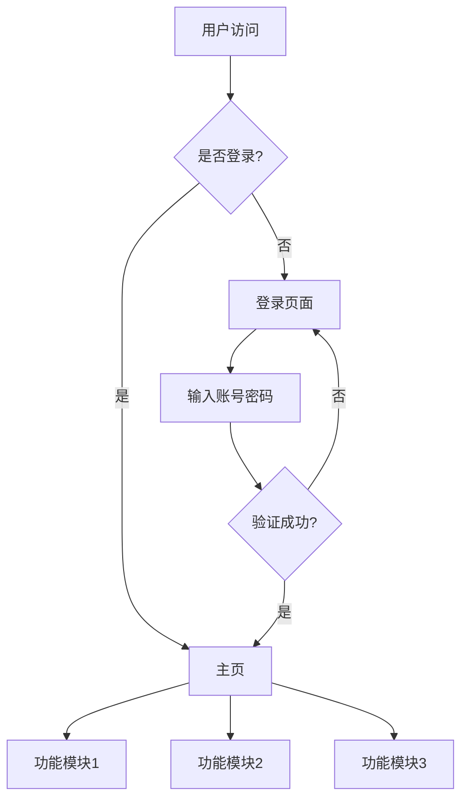

# 阶段2：架构锁档

## 概述

阶段2是核心锁档阶段，负责设计系统架构，锁定目录结构、依赖清单、接口定义。

## 核心任务

1. 绘制Mermaid业务流程图
2. 完成模块拆分、定义接口
3. 锁定最终目录结构
4. 整理第三方依赖/SDK/Skill清单

## AI引导话术

```
现在进入架构设计阶段。这是核心锁档阶段，一旦确认，后续阶段不得私自修改。

基于您的需求，我会：

1. 绘制业务流程图（Mermaid格式）
2. 设计模块拆分方案
3. 定义接口规范
4. 锁定目录结构
5. 整理依赖清单

请告诉我：
1. 您偏好的技术栈是什么？（如：React/Vue/Python等）
2. 有必须使用的第三方服务吗？
3. 有性能或安全方面的特殊要求吗？
```

## 产出

- Mermaid业务流程图
- 架构说明文档
- 固定目录树
- 依赖清单

## 锁档确认

```
AI: 架构设计已完成。这是核心锁档文件：
[架构文档内容]

⚠️ 重要提醒：这是阶段2的核心锁档，一旦确认，后续阶段不得私自修改。

请确认：
- [ ] 我已审核业务流程图
- [ ] 我已确认目录结构
- [ ] 我已确认依赖清单
- [ ] 我已确认接口定义
- [ ] 我同意锁定以上内容

请确认是否同意锁定？
```

## 铁律检查

- 铁律2：阶段2定稿的目录、依赖、接口不得私自修改
- 铁律3：未编造不存在的接口
- 铁律7：未编写死代码、占位代码

## Git审计

```
确认后，执行：
git add .
git commit -m "[Stage-2] 锁档：流程图+目录树+依赖清单"
```

## 架构文档模板

```markdown
# 项目架构文档

## 业务流程图



## 模块拆分

### 模块列表
1. [模块1名称]：[模块1功能]
2. [模块2名称]：[模块2功能]
3. [模块3名称]：[模块3功能]

### 模块依赖关系
```
模块1 → 模块2
模块2 → 模块3
```

## 目录结构

```
project/
├── src/
│   ├── components/     # 组件目录
│   ├── hooks/          # 自定义Hook
│   ├── utils/          # 工具函数
│   ├── types/          # 类型定义
│   └── App.tsx         # 主组件
├── public/             # 静态资源
├── package.json        # 依赖配置
└── README.md           # 项目说明
```

## 依赖清单

### 生产依赖
| 依赖包 | 版本 | 用途 |
|--------|------|------|
| react | ^18.0.0 | 前端框架 |
| react-dom | ^18.0.0 | DOM渲染 |

### 开发依赖
| 依赖包 | 版本 | 用途 |
|--------|------|------|
| typescript | ^4.9.0 | 类型检查 |
| vite | ^4.0.0 | 构建工具 |

## 接口定义

### API接口
| 接口 | 方法 | 路径 | 说明 |
|------|------|------|------|
| 获取列表 | GET | /api/list | 获取数据列表 |
| 创建 | POST | /api/create | 创建新数据 |
| 更新 | PUT | /api/update/:id | 更新数据 |
| 删除 | DELETE | /api/delete/:id | 删除数据 |

### 组件接口
| 组件 | Props | 说明 |
|------|-------|------|
| Header | title: string | 页面标题 |
| List | items: Item[] | 数据列表 |
| Form | onSubmit: Function | 提交表单 |
```

## 阶段总结

```
AI: 阶段2完成。

产出：
- 业务流程图：已绘制
- 目录结构：已锁定
- 依赖清单：已确认
- 接口定义：已确认

⚠️ 以上内容已锁定，后续阶段不得私自修改。

请确认，确认后进入阶段3：环境对齐。
```
