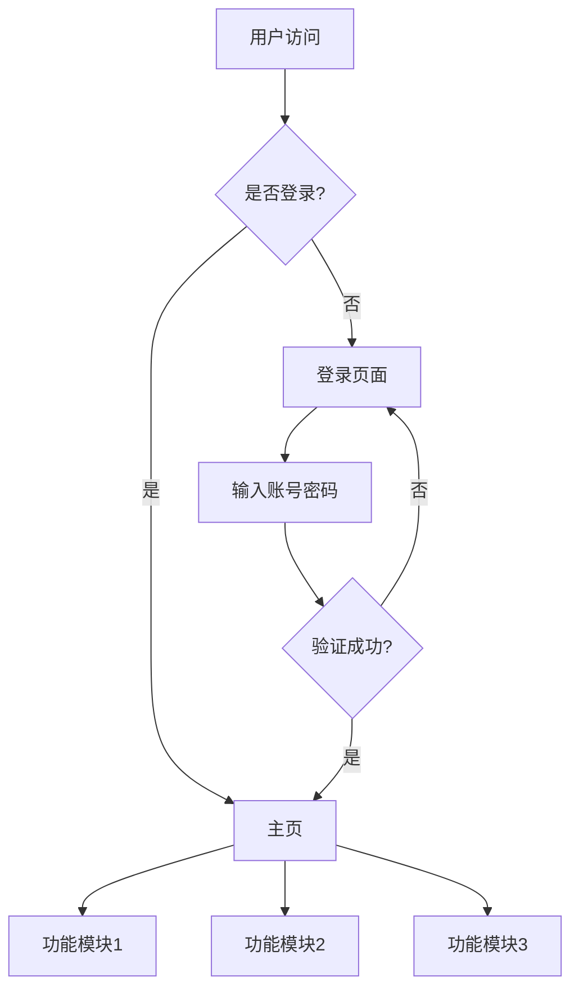

# 架构模板

## 概述

架构模板用于阶段2：架构锁档，帮助用户设计系统架构。

## 模板内容

```markdown
# 项目架构文档

## 业务流程图



## 模块拆分

### 模块列表
1. [模块1名称]：[模块1功能]
2. [模块2名称]：[模块2功能]
3. [模块3名称]：[模块3功能]

### 模块依赖关系
```
模块1 → 模块2
模块2 → 模块3
```

## 目录结构

```
project/
├── src/
│   ├── components/     # 组件目录
│   ├── hooks/          # 自定义Hook
│   ├── utils/          # 工具函数
│   ├── types/          # 类型定义
│   └── App.tsx         # 主组件
├── public/             # 静态资源
├── package.json        # 依赖配置
└── README.md           # 项目说明
```

## 依赖清单

### 生产依赖
| 依赖包 | 版本 | 用途 |
|--------|------|------|
| react | ^18.0.0 | 前端框架 |
| react-dom | ^18.0.0 | DOM渲染 |

### 开发依赖
| 依赖包 | 版本 | 用途 |
|--------|------|------|
| typescript | ^4.9.0 | 类型检查 |
| vite | ^4.0.0 | 构建工具 |

## 接口定义

### API接口
| 接口 | 方法 | 路径 | 说明 |
|------|------|------|------|
| 获取列表 | GET | /api/list | 获取数据列表 |
| 创建 | POST | /api/create | 创建新数据 |
| 更新 | PUT | /api/update/:id | 更新数据 |
| 删除 | DELETE | /api/delete/:id | 删除数据 |

### 组件接口
| 组件 | Props | 说明 |
|------|-------|------|
| Header | title: string | 页面标题 |
| List | items: Item[] | 数据列表 |
| Form | onSubmit: Function | 提交表单 |
```

## 使用说明

1. 复制模板内容
2. 根据项目情况填写
3. 与AI确认架构
4. 人工审核后锁定

## 注意事项

1. 业务流程图要清晰
2. 模块拆分要合理
3. 目录结构要规范
4. 依赖清单要完整
5. 接口定义要明确
